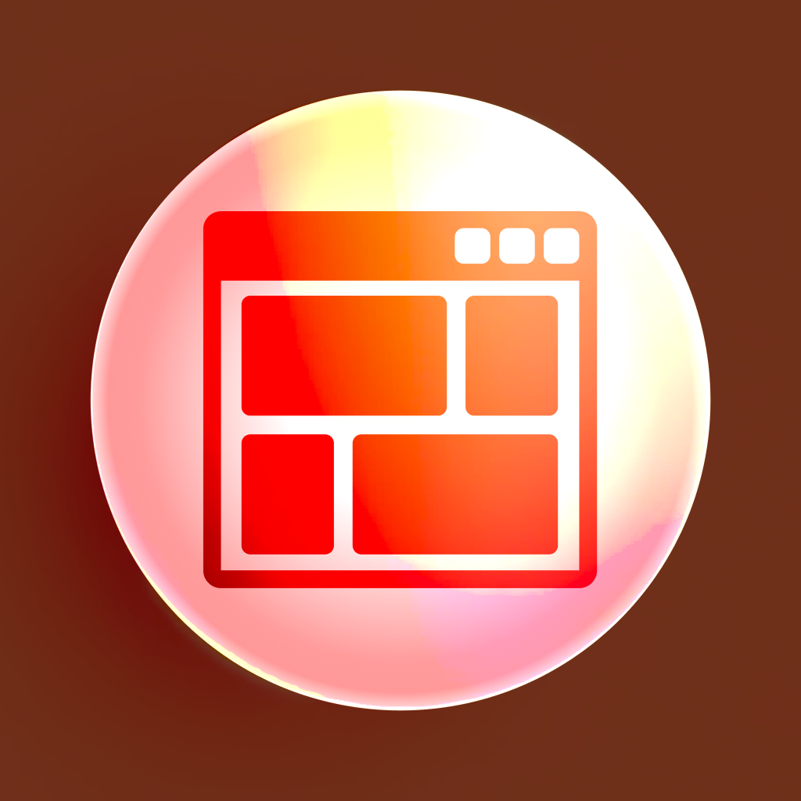

<br>
# UI
<i>A flexbox layout behavior for Construct 3.</i> <br>
### Version 1.0.0.3

[](https://github.com/skymen/flexbox/releases/download/flexbox-1.0.0.3.c3addon/flexbox-1.0.0.3.c3addon)
<br>
<sub> [See all releases](https://github.com/skymen/flexbox/releases) </sub> <br>

---
<b><u>Author:</u></b> skymen <br>
<b>[Addon Website](https://constructfund.github.io/construct3-ui)</b>  <br>
<b>[Documentation](https://constructfund.github.io/construct3-ui)</b>  <br>
<sub>Made using [CAW](https://marketplace.visualstudio.com/items?itemName=skymen.caw) </sub><br>

## Table of Contents
- [Usage](#usage)
- [Examples Files](#examples-files)
- [Properties](#properties)
- [Actions](#actions)
- [Conditions](#conditions)
- [Expressions](#expressions)
---
## Usage
To build the addon, run the following commands:

```
npm i
npm run build
```

To run the dev server, run

```
npm i
npm run dev
```

## Examples Files
| Description | Download |
| --- | --- |

---
## Properties
| Property Name | Description | Type |
| --- | --- | --- |
| Enabled | Whether the flexbox behavior is enabled. | check |
| Classes | A space-separated list of classes to apply to the element. | text |
| Style | Custom styles to apply to the element. | longtext |


---
## Actions
| Action | Description | Params
| --- | --- | --- |
| Add Classes | Adds classes to the UI element | Classes             *(string)* <br> |
| Remove Classes | Removes classes from the UI element | Classes             *(string)* <br> |
| Set Classes | Sets the classes of the UI element | Classes             *(string)* <br> |
| Set Enabled | Sets the enabled state of the UI element | Enabled             *(boolean)* <br> |
| Remove Style Property | Removes a specific style property from the UI element | Property             *(string)* <br> |
| Set Style | Sets the style of the UI element | Style             *(string)* <br> |
| Set Style Property | Sets a specific style property of the UI element | Property             *(string)* <br>Value             *(string)* <br> |


---
## Conditions
| Condition | Description | Params
| --- | --- | --- |
| Is Enabled | Checks if the UI element is enabled |  |


---
## Expressions
| Expression | Description | Return Type | Params
| --- | --- | --- | --- |
